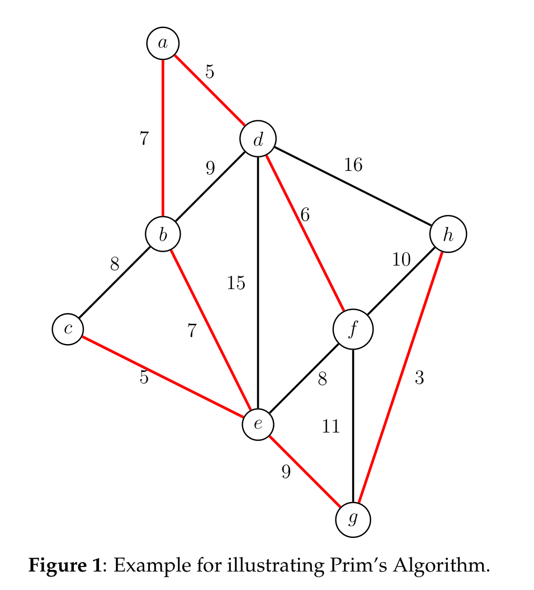
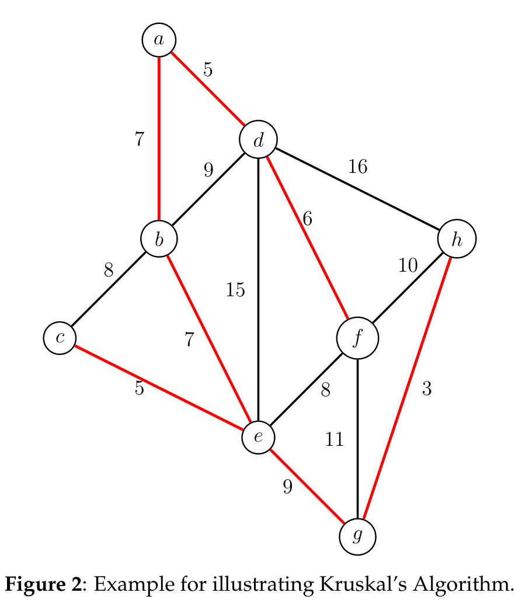

# Part 1: MST Foundations

This covers the definitions and properties you need before anything else. If you watched the lecture, this will formalize what you saw.

---

## Definitions

A _tree_ is a connected, acyclic graph.

A _spanning tree_ of a graph G is a subset of the edges of G that form a tree and include all vertices of G.

The _Minimum Spanning Tree_ problem: Given an undirected graph $`G = (V, E)`$ and edge weights $`w : E \to \mathbb{R}`$, find a spanning tree $`T`$ of minimum weight $`\sum_{e \in T} w(e)`$.

---

## MST Properties

Everything in this interview rests on two properties. Learn these cold.

### Cut Property

A _cut_ partitions the vertices into two non-empty sets $`(S, V \setminus S)`$. A _crossing edge_ has one endpoint in each set.

**Theorem [Cut Property].** _For any cut $`(S, V \setminus S)`$, the least-weight crossing edge must belong to some MST._

_Proof:_ Exchange argument. Let $`e = (u, v)`$ be the least-weight crossing edge and $`T`$ be any MST. If $`T`$ contains $`e`$, done. Otherwise, the unique path from $`u`$ to $`v`$ in $`T`$ must cross the cut somewhere via some edge $`e'`$. Replace $`e'`$ with $`e`$ to form $`T'`$. Since $`w(e) \le w(e')`$, we have $`w(T') \le w(T)`$, so $`T'`$ is also an MST containing $`e`$. $`\square`$

A stronger version (CLRS4 Theorem 21.1) also applies when building a partial tree:

**Theorem (Safe Edge Theorem).** _Given a subset $`A`$ of edges included in some MST, a cut that respects $`A`$, and a light edge $`e`$ crossing the cut, then $`e`$ is **safe** for $`A`$ -- adding it keeps the edge set a subset of some MST._

In other words: if you haven't made a bad decision yet, picking the lightest edge across any cut is always safe.

### Cycle Property

**Theorem [Cycle Property].** _For any cycle $`C`$ in $`G`$, if edge $`e`$ is strictly heavier than every other edge in $`C`$, then $`e`$ cannot belong to any MST._

_Proof:_ Contradiction. Suppose $`e = (u, v)`$ belongs to MST $`T`$. Remove $`e`$, splitting $`T`$ into $`T_u`$ and $`T_v`$. The rest of the cycle provides another path from $`u`$ to $`v`$, so some edge $`e'`$ on that path crosses from $`T_u`$ to $`T_v`$. Since $`e`$ is strictly heavier, $`T - e + e'`$ is a cheaper spanning tree, contradicting that $`T`$ is an MST. $`\square`$

### The Cut-Cycle Duality

These two properties are duals of each other, and they drive every MST update:

- **Cut property:** The lightest edge across a cut _must_ be in the MST.
- **Cycle property:** The heaviest edge in a cycle _cannot_ be in the MST.

When you add an edge to an MST, you create a cycle. Remove the heaviest edge in that cycle (cycle property).

When you remove an edge from an MST, you create a cut. Add the lightest edge crossing that cut (cut property).

This is the core technique for everything in Part 2.

### Uniqueness Property

**Theorem.** _If all edge weights are distinct, the MST is unique._

_Proof:_ Contradiction. Suppose two distinct MSTs $`T_1`$ and $`T_2`$ exist. Let $`e \in T_1 \setminus T_2`$. Adding $`e`$ to $`T_2`$ forms a cycle. The heaviest edge $`e'`$ in this cycle exists and is unique (distinct weights). By the cycle property, $`e'`$ can't be in any MST -- but every edge in the cycle is in $`T_1`$ or $`T_2`$. Contradiction. $`\square`$

---

## Algorithms

A generic MST algorithm grows a tree one safe edge at a time:

```
GENERIC-MST(G = (V, E, w))
1: T <- empty set
2: while T is not spanning do
3:     Find an edge e that is safe for T
4:     Add e to T
5: return T
```

### Prim's Algorithm

Grows a single tree. At each step, add the lightest edge connecting the tree to a vertex not yet in the tree.

```
PRIM(G = (V, E, w))
 1: Pick starting vertex s
 2: T_V <- {s}, T_E <- empty set
 3: while T is not spanning do
 4:     Find lightest edge e = (u,v) with u in T_V, v not in T_V
 5:     Add v to T_V, add e to T_E
 6: return T_E
```

**Correctness:** At each step, the cut $`(T_V, V \setminus T_V)`$ respects the edges added so far. The lightest crossing edge is safe by the Safe Edge Theorem.

**Runtime:**

| Priority Queue | Total |
|---|---|
| Array | $`O(V^2)`$ |
| Binary heap | $`O(E \log V)`$ |
| Fibonacci heap | $`O(E + V \log V)`$ |

**Example:** Trace Prim's algorithm on this graph, starting at vertex $`a`$. MST edges are red.



1. Start at $`a`$. Add $`(a, d)`$, then $`(d, f)`$, then $`(a, b)`$, then $`(b, e)`$, then $`(c, e)`$, then $`(e, g)`$, then $`(g, h)`$.

### Kruskal's Algorithm

Grows a forest. Sort all edges by weight. Add each edge if it connects two different components.

```
KRUSKAL(G = (V, E, w))
 1: T <- empty set
 2: for v in V: MAKE-SET(v)
 3: Sort edges by weight
 4: for e = (u,v) in sorted order:
 5:     if FIND-SET(u) != FIND-SET(v):
 6:         Add e to T
 7:         UNION(u, v)
 8: return T
```

**Correctness:** When adding edge $`e`$ between components $`C_1`$ and $`C_2`$, the cut $`(C_1, V \setminus C_1)`$ respects all previously added edges. Since $`e`$ is the lightest remaining edge crossing this cut (sorted order), it's safe.

**Runtime:** $`O(E \log V)`$ (dominated by sorting).

**Example:** Trace Kruskal's algorithm on the same graph. MST edges are red.



1. Sort edges. Add $`(g,h)`$, $`(c,e)`$, $`(a,d)`$, $`(d,f)`$, $`(a,b)`$, $`(b,e)`$. Skip $`(b,c)`$ (same component). Add $`(e,g)`$. Done.

---

## What to make sure you understand before Part 2

- [ ] Given a graph, you can find the MST by hand using either algorithm
- [ ] You can explain why the cut property makes greedy MST algorithms correct
- [ ] You can explain why the heaviest edge in a cycle can't be in the MST
- [ ] You understand the duality: add edge → cycle → remove heaviest; remove edge → cut → add lightest

---

*Sources: MIT 6.1220/18.410J Recitation 5 (Fall 2023); CLRS4 Ch. 21.*
