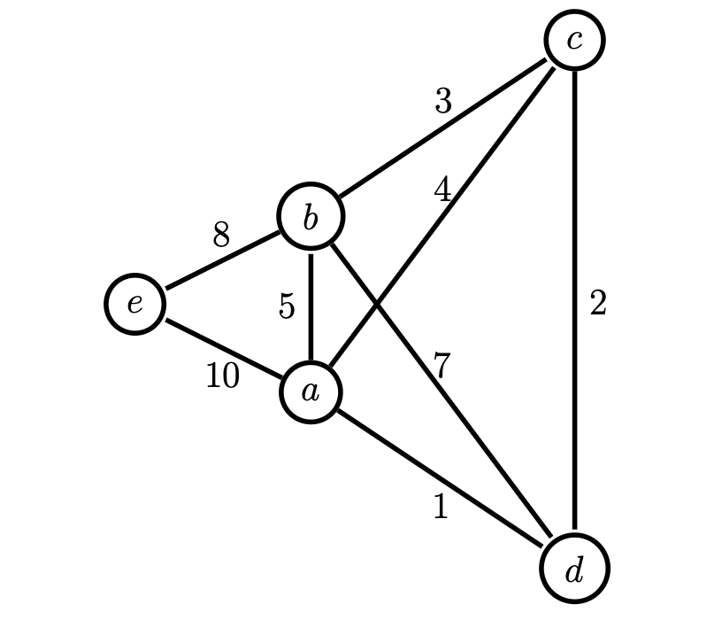

# Part 3: Practice Problems

Work through these without peeking at solutions. Solutions are at the bottom of this file.

These problems test exactly the skills from Parts 1 and 2. If you can solve all of them, you're ready for the interview.

---

# Problems

---

### Problem 1: MST Quickies

Prove each of the following statements or provide a counterexample if it is not true.

**(a)** If a graph with no self-loops has a unique minimum edge, it must be in every MST of the graph.

**(b)** If a graph with at least 2 edges has a unique maximum edge, it cannot appear in any MST.

**(c)** The MST of a graph must contain the shortest path from every vertex $`u`$ to every vertex $`v`$.

**(d)** A cycle has two edges $`e_1`$ and $`e_2`$, both with weight $`w`$, where all other edges in the cycle have weights strictly less than $`w`$. No MST can contain both $`e_1`$ and $`e_2`$.

*These build fluency with cut and cycle properties. You need to be fast with these arguments before tackling dynamic updates.*

---

### Problem 2: Subway MST

The MBTA's subway system has collapsed. You need to rebuild the cheapest tunnel network connecting all stations. The subway is a graph $`G = (V, E, c)`$ with **unique** edge costs.

You find the MST $`T`$ of $`G`$. Then the engineers discover a new tunnel $`e`$ is now possible between two existing stations at cost $`c(e)`$.

**(a)** Prove that the following algorithm computes the MST of the new graph $`G' = (V, E \cup \{e\})`$: add $`e`$ to $`T`$, then delete the heaviest edge in the cycle created.

**(b)** Now a new station $`v'`$ is added with edges $`E'`$ to existing stations. Design an $`O(|V| \log |V|)`$ algorithm to compute the MST of $`G' = (V \cup \{v'\}, E \cup E')`$, given only $`T`$, $`v'`$, and $`E'`$.

*Part (a) is the fundamental edge insertion primitive. Part (b) forces you to reason about which edges can possibly be in the new MST -- the same filtering argument you'll need in the interview.*

---

### Problem 3: Dynamic Edge Weight Change

You have an undirected weighted graph $`G`$ and its MST $`T`$.

**(a)** Describe an algorithm to update the MST when the weight of a single edge $`e`$ is **decreased**.

**(b)** Describe an algorithm to update the MST when the weight of a single edge $`e`$ is **increased**.

*[Hint: Consider the cases $`e \in T`$ and $`e \notin T`$ separately.]*

*This is the complete picture: 4 sub-cases that cover every possible weight change. The interview will present a concrete graph where you need to identify which cases apply and execute the updates.*

---

### Problem 4: Second-Best MST

Let $`G = (V, E)`$ be an undirected, connected graph with distinct edge weights and $`|E| \ge |V|`$.

A second-best MST is a spanning tree $`T`$ such that $`w(T)`$ is minimized over all spanning trees other than the MST.

**(a)** *[Warm-up]* How many second-best MSTs does this graph have?


**(b)** Prove that any second-best MST differs from the MST in exactly one edge. That is: there exists $`(u,v) \in T`$ and $`(x,y) \notin T`$ such that $`T \setminus \{(u,v)\} \cup \{(x,y)\}`$ is a second-best MST, and no spanning tree differing in more than one edge can be second-best.

**(c)** Given the MST $`T`$, describe an $`O(|V|^2)`$ algorithm to compute $`\text{max}[u,v]`$ -- the heaviest edge on the path from $`u`$ to $`v`$ in $`T`$ -- for all pairs $`u, v`$.

**(d)** Give an $`O(|V|^2)`$ algorithm to compute a second-best MST.

*This problem ties everything together. Part (b) is a structural proof using the cycle property. Parts (c)-(d) build toward an algorithm that relies on the same "add edge, find heaviest in path, swap" primitive from dynamic MST. If you understand why the second-best MST is always one swap away, you deeply understand the exchange argument.*

---
---

# Solutions

---

### Problem 1: MST Quickies

**(a)** True. Contradiction using cycle property. Suppose MST $`T`$ doesn't contain the unique minimum edge $`e`$. Add $`e`$ to $`T`$ forming a cycle. Every other edge in the cycle is heavier than $`e`$ (since $`e`$ is the unique minimum). So $`T + e - e'`$ for any other cycle edge $`e'`$ is a cheaper spanning tree. Contradiction.

**(b)** False. Consider a node of degree 1. Give the highest weight to its only edge. That edge must be in every spanning tree (and therefore every MST).

**(c)** False. The complete graph on $`n`$ vertices with unit weights. The MST has $`n-1`$ edges but the shortest path between any non-adjacent pair is a direct edge, which isn't in the MST.

**(d)** True. Suppose both $`e_1 = (u,v)`$ and $`e_2`$ are in some MST $`T`$. Remove $`e_1`$, splitting $`T`$ into $`T_u`$ and $`T_v`$. Walk along the rest of the cycle from $`u`$ to $`v`$ -- at some point an edge $`e'`$ crosses from $`T_u`$ to $`T_v`$. Since $`e' \ne e_2`$ (otherwise $`e_2`$ would be a crossing edge, not a cycle edge with $`e_1`$) and $`w(e') < w = w(e_1)`$, the tree $`T - e_1 + e'`$ is cheaper. Contradiction.

---

### Problem 2: Subway MST

**(a)** First, we show that only edges in $`T \cup \{e\}`$ can be in the new MST. For any old non-tree edge $`e' \in E \setminus T`$: since $`e'`$ wasn't in the MST of $`G`$, adding $`e'`$ to $`T`$ creates a cycle where $`e'`$ is the heaviest edge. This cycle still exists in $`G'`$. By the cycle property, $`e'`$ still can't be in any MST.

Now $`T \cup \{e\}`$ has $`n`$ edges and exactly one cycle. The heaviest edge in that cycle cannot be in the MST (cycle property). Removing it leaves $`n-1`$ edges forming a spanning tree. Since these are the only edges that can be in the MST, this must be the MST.

**(b)** By the argument in (a), only edges in $`R = T \cup E'`$ can be in the new MST. Build the graph $`G'' = (V \cup \{v'\}, R)`$. This has at most $`(|V|-1) + |E'| \le 2|V|`$ edges. Run Kruskal's algorithm on $`G''`$ in $`O(|V| \log |V|)`$ time.

---

### Problem 3: Dynamic Edge Weight Change

**(a)** Weight **decreased** -- two sub-cases:

- $`e \notin T`$: Add $`e`$ to $`T`$, creating a cycle. Let $`e^*`$ be the heaviest edge in the cycle. If $`e^* = e`$, no change. If $`e^* \ne e`$, swap: $`T' = T - e^* + e`$. (Cycle property.)

- $`e \in T`$: Decreasing a tree edge only makes $`T`$ cheaper. Structure unchanged.

**(b)** Weight **increased** -- two sub-cases:

- $`e \notin T`$: A non-tree edge getting heavier can't help. No change.

- $`e \in T`$: Remove $`e`$, splitting $`T`$ into $`T_u`$ and $`T_v`$. Find the lightest non-tree edge $`e'`$ crossing the cut $`(T_u, T_v)`$. If $`w(e') < w_{\text{new}}(e)`$, swap: $`T' = T - e + e'`$. Otherwise, keep $`e`$ with its new weight. (Cut property.)

---

### Problem 4: Second-Best MST

**(a)** 3. The MST has edges $`(a,d), (c,d), (b,c), (b,e)`$. The three second-best MSTs each swap exactly one edge.



**(b)** Since edge weights are distinct, the MST $`T`$ is unique. Any second-best MST $`T'`$ differs from $`T`$ in at least one edge. Suppose $`T'`$ differs in two or more edges, i.e., $`|T \setminus T'| \ge 2`$.

Pick $`(u,v) \in T \setminus T'`$. Add $`(u,v)`$ to $`T'`$, creating a cycle. Since $`(u,v) \in T`$, it can't be the heaviest in this cycle (otherwise $`T`$ wouldn't be an MST). So some edge $`(x,y) \in T'`$ on the cycle has $`w(x,y) > w(u,v)`$. Replace $`(x,y)`$ with $`(u,v)`$ in $`T'`$:

- Still a spanning tree (cycle edge replaced).
- Cheaper than $`T'`$ (lighter edge substituted).
- Not equal to $`T`$ (we only changed one of the 2+ differing edges).
- Therefore costlier than $`T`$ (since $`T`$ is the unique MST).

We've built a spanning tree strictly between $`T`$ and $`T'`$ in cost. So $`T'`$ can't be second-best. Contradiction.

**(c)** For each vertex $`u`$, run DFS from $`u`$ on $`T`$:

```
DFS(u, x):
    Mark x as visited
    For each unvisited neighbor v of x in T:
        max[u, v] <- heavier of max[u, x] and edge (x, v)
        DFS(u, v)
```

$`|V|`$ DFS calls, each $`O(|V|)`$ on the tree. Total: $`O(|V|^2)`$.

**(d)** Compute MST $`T`$ using Prim's: $`O(|V|^2)`$. Compute all $`\text{max}[u,v]`$ using part (c): $`O(|V|^2)`$. For each non-tree edge $`(u,v) \in E \setminus T`$, compute the swap cost $`w(u,v) - w(\text{max}[u,v])`$. Pick the edge $`(u',v')`$ minimizing this. The second-best MST is $`T \setminus \{\text{max}[u',v']\} \cup \{(u',v')\}`$.

Correctness: Part (b) proves second-best MST is always a single swap. We want the swap that increases total weight the least. For a non-tree edge $`(u,v)`$, adding it creates a cycle; the best swap removes the heaviest edge on the tree path (which is $`\text{max}[u,v]`$). The swap increasing weight the least is the one minimizing $`w(u,v) - w(\text{max}[u,v])`$.

---

## Sources

1. **MST Quickies** -- MIT 6.1220, Fall 2019 Quiz 2, Problem 3
2. **Subway MST** -- MIT 6.1220/18.410J, Recitation 5, Fall 2023
3. **Dynamic Edge Weight Change** -- Jeff Erickson, *Algorithms*, Ch. 7, Exercise 5
4. **Second-Best MST** -- MIT 6.1220/18.410J, Problem Set 5, Fall 2023
